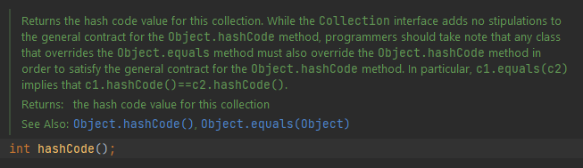

# Equals e HashCode

Quando você quer procurar um determinado item em uma lista de itens em java, você utliza o método `contains` do java.util.Collection, certo?

E, para fazer essa procura/comparação você sobrescreve o método `equals` da classe `Object`: 

  

O `equals`, você define da maneira que preferir, de acordo com o comparardor de sua preferência.

Mas se você tem uma coleção que tem um núemro muito grande de itens, fazer a busca desta forma demanda um tempo e complexidade alta.
Por isso, existe a tabela Hash, que é uma tabela onde as informações são armazenadas conforme um "numero hash" calculado com base nas propriedades da informação que você deseja usar como comparador.
Isso permite que seja muito rápido recuperar uma informação na tabela.

Logo, como o próprio Intellij recomenda:

  

Devemos implementar hashCode e equals juntos!

Nos arquivos, você pode ver um exemplo de uso do hashCode e do equals. 

OBS.: As IDEs normalmente te ajudam a implementar esses métodos.
